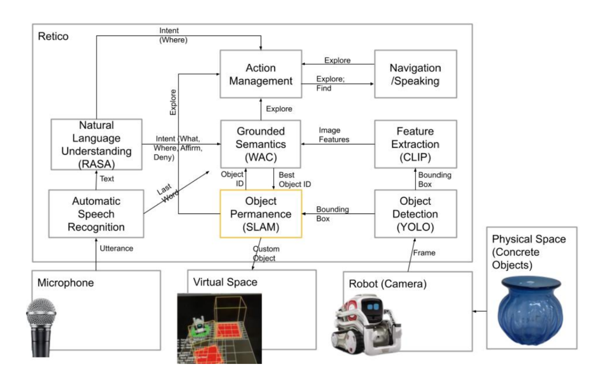

# IROS 2025 Retico Tutorial

### Overview

Welcome to the website for the IROS 2025 Retico tutorial! Retico is a 'robot-ready' spoken dialogue system framework that has been increasingly used for robotic platform because it is incremental (i.e., processes at the word level), distributed (integrates with ROS and ZeroMQ), multimodal (can integrate information from microphones, cameras, robot states, etc), and can be made to be temporally aligned. Retico [is completely open source with example systems](https://github.com/retico-team?view_as=public). 

### History
Retico began as a research project, has been upgraded and expanded in the past few years, and recent U.S. National Science Foundation funding has enabled further development of research tools for visualization, benchmarks, and virtual robot platforms. More researchers and practitioners than ever are turning to dialogue systems as a method of communication between humans and robots. Moreover, as agent-based learning and interaction has become more important in the CL/NLP/Robotics communities, this tutorial is very timely.  

### Tutorial Content

The tutorial will first introduce participants to Retico: how to find it and what modules are already available. We will then show them how to plug the modules together to build a fully working system with robot examples. We will then help participants build their own modules and give them some time to work so they recognize how easy it is to make new modules and plug them into existing systems. We will also show participants how to use the tools such as visualization, logging, and bindings with Copellia Sim, a robot simulation platform. We will answer questions participants might have throughout. 

### Organizers

- Casey Kennington, Associate Professor, Boise State University - caseykennington@boisestate.edu 
- Anna Manaseryan, Graduate Student, Boise State University

### Schedule

- Brief intro to Retico (15 minutes)
- Theoretical background (15 minutes)
- Survey of modules (45 minutes)
- Build your own module (45 minutes)
- Break (20 minutes)
- Build your own system (60 minutes)
- Logging and evaluation (30 minutes)

### Intended Audience

Introductory tutorial for roboticists who are interested in natural spoken interaction between humans and robots. Some knowledge of python is needed. Familiarity with transformer models (e.g., from huggingface) is helpful, but not required. We estimate 20-30 participants because Retico is fairly new to the IROS community. 

### Preparation

Bring a laptop! Not a huge problem if you don't; just showing up and observing will help you learn about Retico, but having a laptop will give you hands-on experience. It helps if you [read about Retico](https://github.com/retico-team?view_as=public) and about the [Incremental Unit Theoretical Model](https://journals.uic.edu/ojs/index.php/dad/article/view/10712). 

